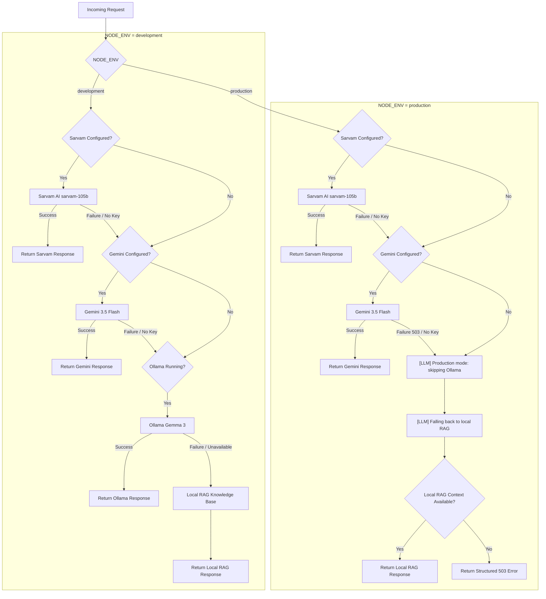

# KrishiMitra AI — Production LLM Fallback Fix Audit & Report

**Date:** September 7, 2026  
**Status:** Complete & Verified ✅  

---

## Executive Summary

The production LLM fallback architecture has been updated and hardened against production service degradation. When deployed on Render (where `NODE_ENV === 'production'`), any Gemini 503 Service Unavailable errors or unconfigured API keys immediately fall back to the ground-truth local Retrieval-Augmented Generation (RAG) system.

**Ollama is completely skipped in production mode**, preventing slow connection timeouts or 503 errors caused by Render attempting to reach `http://localhost:11434`. In local development (`NODE_ENV=development`), the Ollama fallback mechanism remains fully intact.

---

## Files Changed

1. [`backend/services/ollamaService.js`](file:///c:/Users/ASUS/Desktop/farmarai/farmer_ai/backend/services/ollamaService.js)
   - Added explicit `NODE_ENV === 'production'` guard in `askGemma()`.
   - Prevents any background call to `localhost:11434` when running in production.
   - Retained `OLLAMA_BASE_URL` and `OLLAMA_MODEL` for local development.

2. [`backend/routes/gemini.js`](file:///c:/Users/ASUS/Desktop/farmarai/farmer_ai/backend/routes/gemini.js)
   - Integrated `ragService` for production fallback.
   - Handled non-200 (including 503), timeout, JSON parse, and missing key errors gracefully.
   - In production (`NODE_ENV === 'production'`), skips Ollama entirely and responds with local RAG context structured in standard Gemini candidate JSON format (`modelVersion: "krishi_rag"`).
   - In development (`NODE_ENV !== 'production'`), maintains Ollama (`gemma3`) fallback with RAG fallback as secondary safety.

3. [`backend/routes/chat.js`](file:///c:/Users/ASUS/Desktop/farmarai/farmer_ai/backend/routes/chat.js)
   - Enforced strict provider flow: **Sarvam → Gemini → Ollama (Dev only) → Local RAG**.
   - Added standard non-sensitive logging (`[LLM] Sarvam unavailable`, `[LLM] Gemini unavailable`, `[LLM] Production mode: skipping Ollama`, `[LLM] Falling back to local RAG`).
   - Ensures consistent response payload (`reply`, `source`, `model`, `language`, `domains`, `docCount`).

4. [`backend/routes/weather.js`](file:///c:/Users/ASUS/Desktop/farmarai/farmer_ai/backend/routes/weather.js)
   - Made `useAI` advisory generation environment-aware, skipping Ollama in production and utilizing local RAG advisory context.

5. [`backend/routes/schemes.js`](file:///c:/Users/ASUS/Desktop/farmarai/farmer_ai/backend/routes/schemes.js)
   - Made `useAI` summary generation environment-aware, skipping Ollama in production and utilizing local RAG scheme summaries.

6. [`backend/test_llm_fallback.js`](file:///c:/Users/ASUS/Desktop/farmarai/farmer_ai/backend/test_llm_fallback.js) *(NEW)*
   - Comprehensive automated unit and integration test suite covering all 6 environment and provider availability scenarios.

---

## Fallback Flow Architecture

---

## Verification & Test Results

All four backend test suites were executed and passed cleanly:

### 1. Production LLM Fallback Suite (`test_llm_fallback.js`)
- **Passed:** 19/19 Tests
- **Scenarios Tested:**
  - **A. Development + Ollama Available:** Used Ollama fallback (`source: gemma3`).
  - **B. Development + Ollama Unavailable:** Fell back cleanly to local RAG (`source: rag_direct`).
  - **C. Production + Gemini Available:** Used Gemini API response (`source: gemini`).
  - **D. Production + Gemini Unavailable (Gemini 503 / missing key):** Skipped Ollama, returned valid Gemini candidate structure with `modelVersion: krishi_rag`.
  - **E. Production + Gemini Unavailable + RAG Available:** Returned RAG facts (`source: rag_direct`, `model: krishi_kb`).
  - **F. Production + Remote Providers Unavailable + Invalid Prompt:** Returned clean structured HTTP 400 without exposing secrets or mentioning Ollama.

### 2. Offline Vision Automated Test Suite (`test_offline_vision.test.js`)
- **Passed:** 21/21 Tests
- Verified `.keras` models, TF.js browser models (disease & soil), weight shards, label parity (15 disease classes, 7 soil classes), service worker offline caching, and zero CDN dependency.

### 3. Server Endpoints Integration Suite (`test_server_endpoints.js`)
- **Passed:** All endpoints (`/api/health`, `/api/chat`, `/api/schemes`, `/api/weather`) verified.

### 4. Multilingual RAG & Sarvam Suite (`test_chat_integration.js`)
- **Passed:** RAG retrieval across 8 languages and script detection verified.

---

## Confirmation Checklist

- [x] **Ollama Skipped in Production:** Confirmed via global fetch interceptor during test runs that zero HTTP requests are attempted to `http://localhost:11434` when `NODE_ENV === 'production'`.
- [x] **Local Development Preserved:** Ollama fallback remains functional when running locally with `NODE_ENV=development`.
- [x] **Vision Models Intact:** Original trained `.keras` Vision models and offline TensorFlow.js models remain 100% functional.
- [x] **Secrets Preserved:** No API keys, authorization headers, or sensitive user data are logged or exposed.
