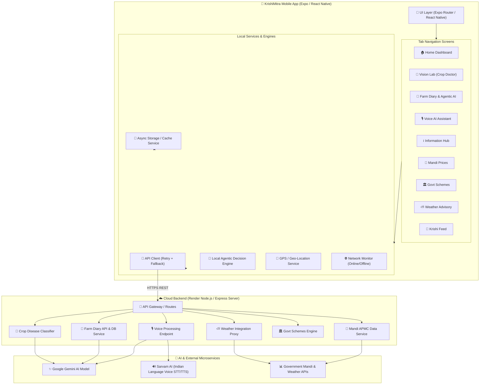

# KrishiMitra AI — System Architecture & Topology

## Overview

KrishiMitra AI is an intelligent, offline-capable mobile assistant designed for farmers. The system is built with a **resilient hybrid architecture** combining local caching and rule engines with cloud-hosted AI microservices.

## System Architecture Photo


## Visual UML Architecture & Fallback Diagram


---

## 1. High-Level System Architecture Diagram



---

## 2. End-to-End Data Flow Sequence Diagram

```mermaid
sequenceDocument
sequenceDiagram
    autonumber
    actor Farmer as 👨‍🌾 Farmer
    participant App as 📱 Mobile UI
    participant Service as ⚙️ Local Service Layer
    participant Cache as 💾 Local Cache / Storage
    participant Backend as ☁️ Render Backend API
    participant AI as 🤖 External AI (Gemini / Sarvam)

    Farmer->>App: Interacts with Feature (e.g., Voice, Vision, Diary)
    App->>Service: Trigger Operation Request
    Service->>Cache: Read Cached State / Farm Memory
    Cache-->>Service: Return Local Data

    alt Device is Offline
        Service-->>App: Serve Local Offline Fallback & Local Decision Engine
        App-->>Farmer: Render Offline Response + Status Warning
    else Device is Online
        Service->>Backend: HTTP POST / GET Payload
        Backend->>AI: Delegate Heavy Inference / Translation / Processing
        AI-->>Backend: Return Structured AI Output / Audio / Analysis
        Backend-->>Service: Return HTTP 200 OK JSON
        Service->>Cache: Update Local Offline Store
        Service-->>App: Render Fresh Dynamic Content
        App-->>Farmer: Display Interactive UI & Next Best Action
    end
```

---

## 3. Technology Stack & Component Mapping

| Component Layer | Technology / Library | Responsibilities |
| :--- | :--- | :--- |
| **Mobile Framework** | Expo SDK 52 / React Native | Native cross-platform app engine |
| **Routing & Navigation** | Expo Router (File-based) | Tab navigation, Stack routes, Deep linking |
| **State & Local Storage** | `@react-native-async-storage/async-storage` | Offline Farm Memory persistence, event cache |
| **Network & Sync** | `@react-native-community/netinfo` | Network connectivity detection & offline queuing |
| **Audio & Voice** | `expo-av` / `expo-audio` | Microphone recording & audio playback |
| **Camera & Image** | `expo-camera` / `expo-image-picker` | Crop disease photo capture & gallery selection |
| **Location & GPS** | `expo-location` | Geo-location coordinates for Mandi & Weather |
| **Backend Gateway** | Node.js / Express.js on Render | REST API endpoints, AI key secrecy, data proxies |
| **AI Models & Voice** | Google Gemini API + Sarvam AI | Agro-intelligence, multimodal analysis, Indian language speech |

---

## Next Diagrams
- [01. Farm Diary & Agentic AI Decision Engine](file:///c:/Users/ASUS/Desktop/farmarai/farmer_ai/krishimitra-mobile/documentation/01_farm_diary_and_agentic_ai.md)
- [02. Vision Crop Disease Detection](file:///c:/Users/ASUS/Desktop/farmarai/farmer_ai/krishimitra-mobile/documentation/02_vision_crop_disease_detection.md)
- [03. Voice AI Assistant](file:///c:/Users/ASUS/Desktop/farmarai/farmer_ai/krishimitra-mobile/documentation/03_voice_ai_assistant.md)
- [04. Mandi Prices & Market Intelligence](file:///c:/Users/ASUS/Desktop/farmarai/farmer_ai/krishimitra-mobile/documentation/04_mandi_prices_and_market_intelligence.md)
- [05. Government Schemes Navigator](file:///c:/Users/ASUS/Desktop/farmarai/farmer_ai/krishimitra-mobile/documentation/05_government_schemes_navigator.md)
- [06. Weather & Microclimate Advisory](file:///c:/Users/ASUS/Desktop/farmarai/farmer_ai/krishimitra-mobile/documentation/06_weather_and_microclimate_advisory.md)
- [07. Krishi Feed & Community Forum](file:///c:/Users/ASUS/Desktop/farmarai/farmer_ai/krishimitra-mobile/documentation/07_krishi_feed_and_community.md)
