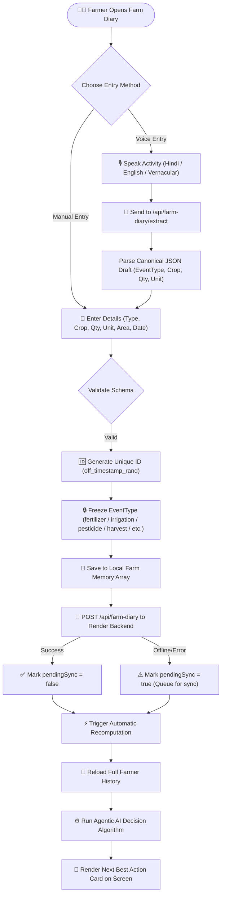
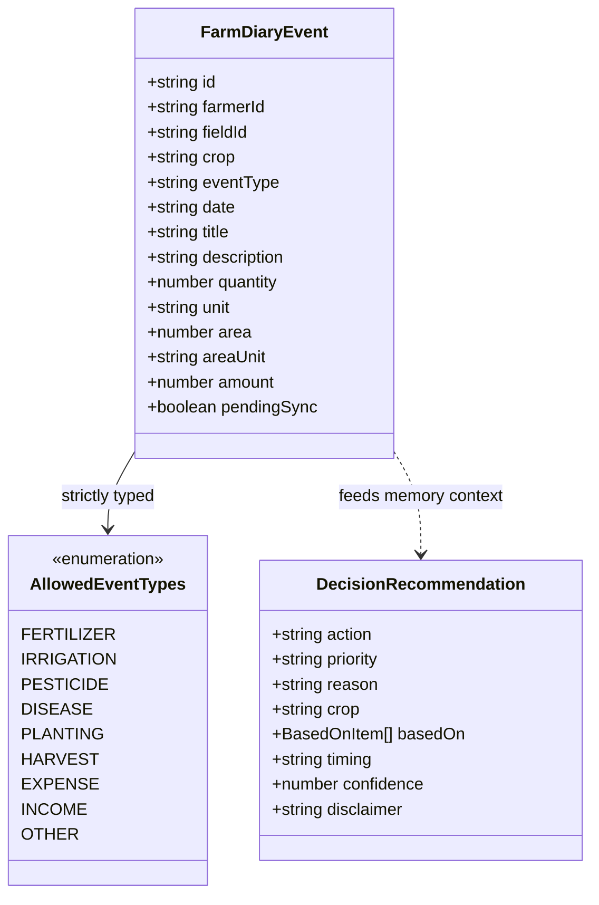
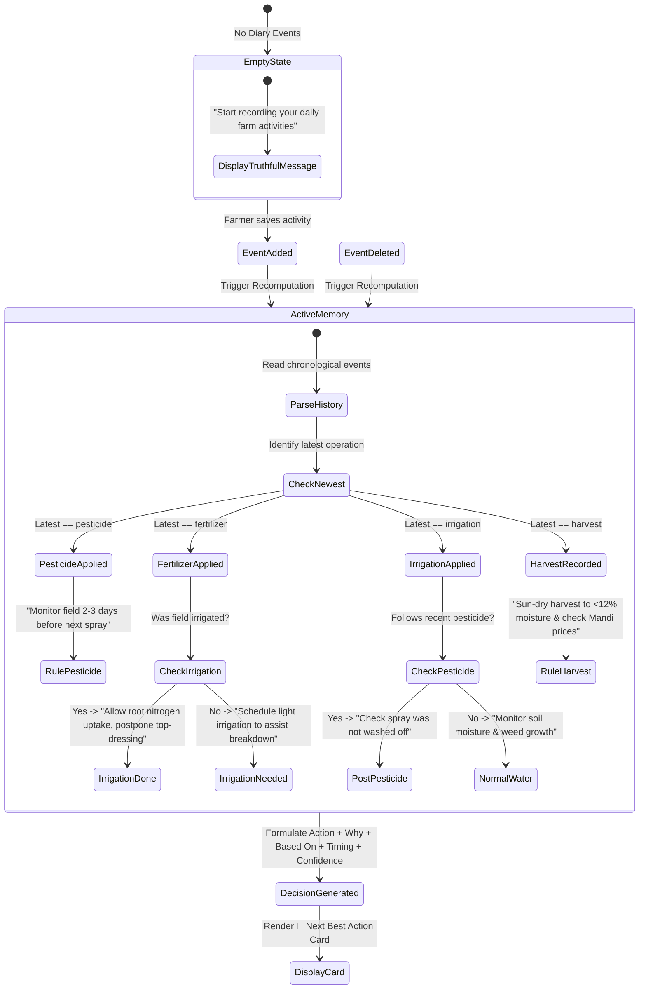
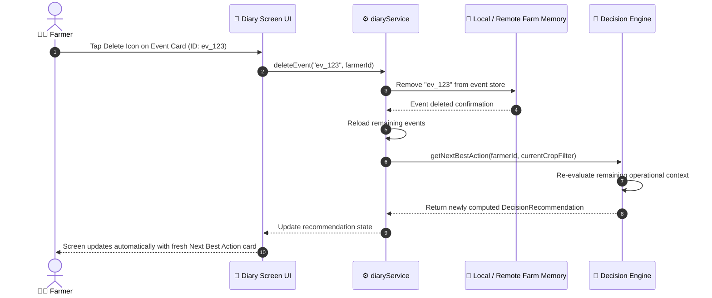

# Farm Diary & Agentic AI Decision Engine

## Overview

The **Farm Diary & Agentic AI Decision Engine** records farmer field operations (fertilizer, irrigation, pesticide, sowing, harvest, expenses) into an immutable **Farm Memory**. It analyzes historical events, current crop growth stage, and microclimate context to generate dynamic **Next Best Action** recommendations.

## Visual UML Sequence & Fallback Diagram

---

## 1. Event Creation & Data Preservation Flowchart

---

## 2. Event Category Isolation System

---

## 3. Agentic Next Best Action Decision Loop (State Machine)

---

## 4. Sequence Diagram: Event Deletion & Recommendation Recalculation

---

## Summary of Guarantees

1. **Category Isolation**: An event with `eventType = "pesticide"` remains permanently classified as `pesticide`. It can never morph into `disease` or `fertilizer`.
2. **Dynamic Context**: Recommendations are dynamically computed based on the exact sequence of historical events (e.g. Fertilizer followed by Irrigation vs. Pesticide followed by Heavy Rain).
3. **No Fake Fallbacks**: If zero events exist, the system explicitly reports insufficient data rather than injecting hardcoded demo events.
