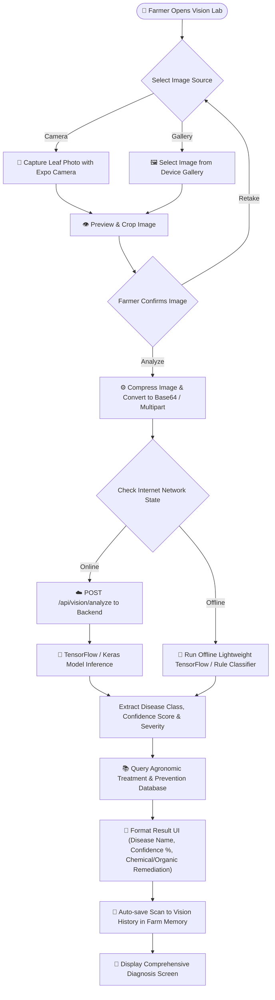
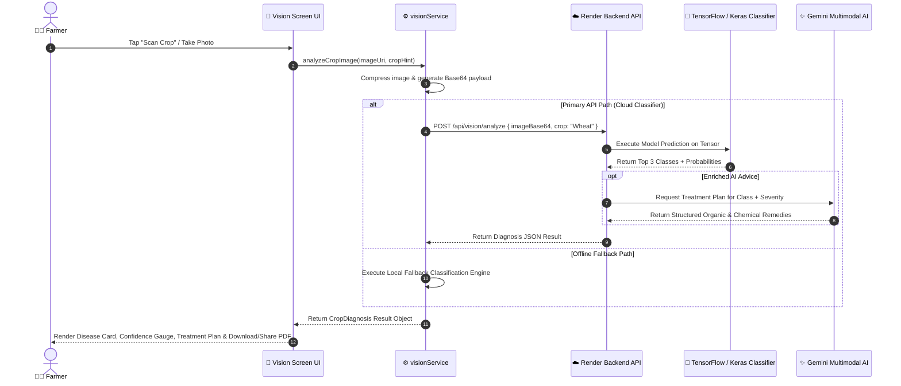
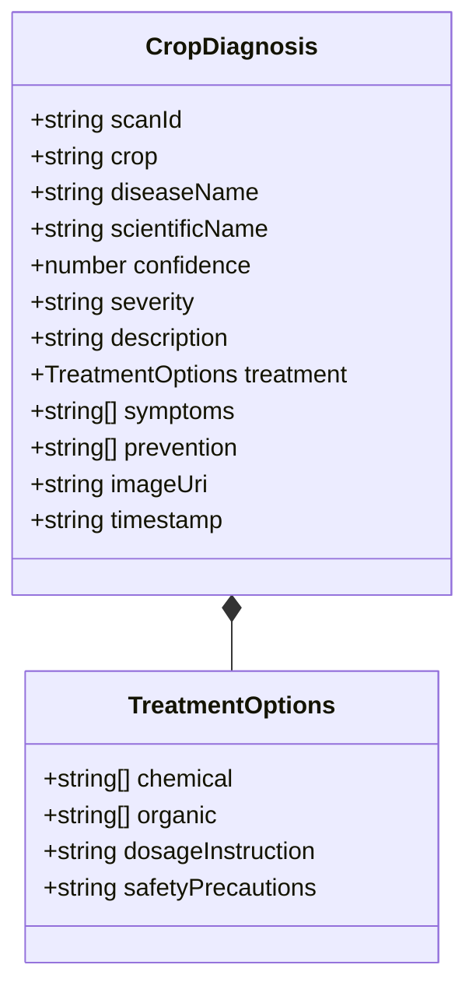

# Vision Lab — Crop Disease Diagnostics

## Overview

The **Vision Lab (Crop Doctor)** enables farmers to scan infected crop leaves or stems using their smartphone camera or gallery images. The system uses a deep neural network classifier paired with an agronomic advisory engine to detect plant pathogens (fungal, bacterial, viral, nutrient deficiency) and recommend specific treatments.

## Visual UML Sequence & Fallback Diagram

---

## 1. Crop Disease Scanning & Diagnosis Flowchart

---

## 2. Image Diagnostics Sequence Diagram

---

## 3. Crop Diagnosis Data Model Diagram

---

## Key Diagnostic Features

- **Multi-Crop Support**: Wheat, Rice (Paddy), Tomato, Potato, Cotton, Maize, Sugarcane, Mustard.
- **Dual Remediation Strategy**: Provides both **Chemical Solutions** (exact pesticide/fungicide names and dosage per acre) and **Organic/Biological Solutions** (neem oil, Trichoderma, crop rotation).
- **Auto-Sync to Diary**: Scan results can be saved directly into the **Farm Diary** as a `disease` or `pesticide` event with a single tap.
