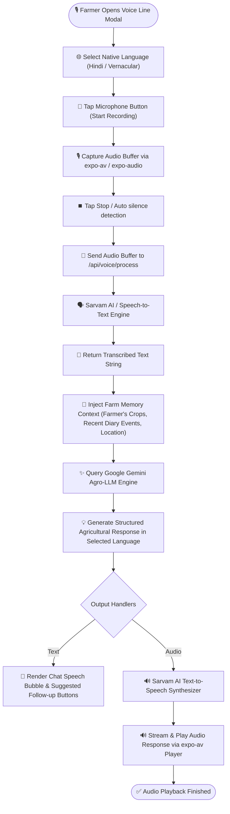
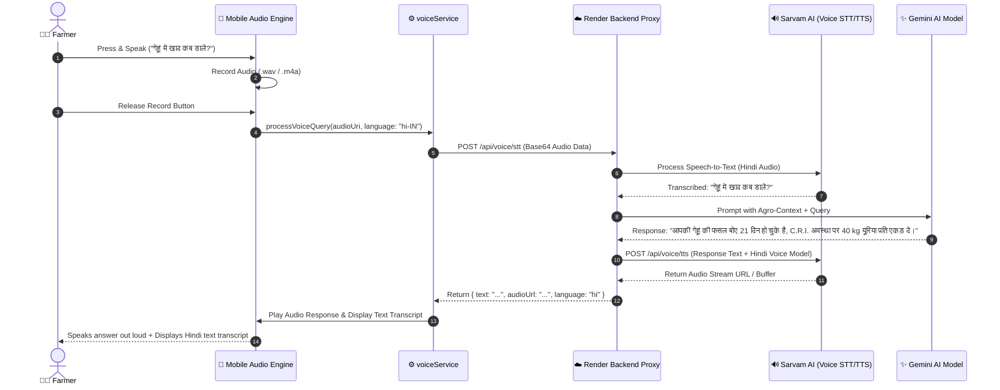
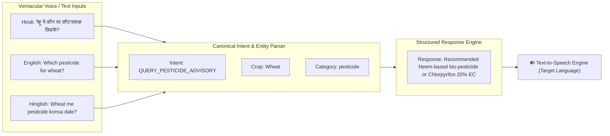

# Voice AI Assistant — Multilingual Voice Line

## Overview

The **Voice AI Assistant (KrishiMitra Voice Line)** allows farmers to speak naturally in their native language (Hindi, Punjabi, Marathi, Gujarati, Tamil, Telugu, English, etc.) to ask agricultural questions, log diary entries, or check market prices.

## Visual UML Sequence & Fallback Diagram

---

## 1. Voice Assistant Interaction Flowchart

---

## 2. Voice Audio Pipeline Sequence Diagram

---

## 3. Multilingual Intent & Language Resolution Matrix

---

## Key Voice Architecture Rules

1. **Zero Secret Exposure**: The mobile app NEVER stores `SARVAM_API_KEY` or `GEMINI_API_KEY`. All voice operations route strictly through the backend gateway `/api/voice/*`.
2. **Offline Fallback Audio**: If the remote voice service is unavailable or offline, pre-recorded local audio assets and text transcript fallbacks are used automatically.
