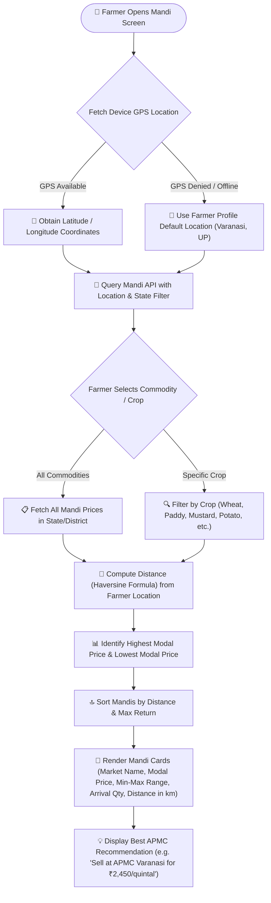
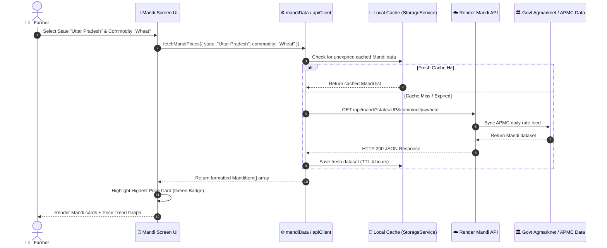
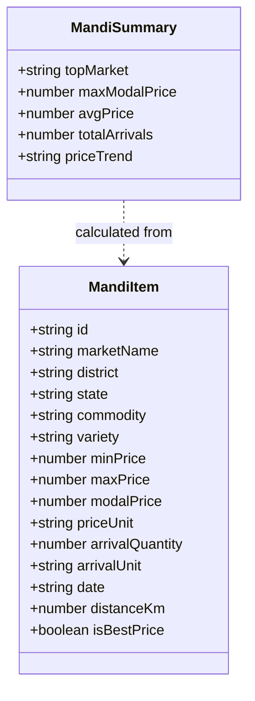

# Mandi Prices & APMC Market Intelligence

## Overview

The **Mandi Prices & Market Intelligence** feature provides real-time agricultural APMC market rates, price trend analysis, highest/lowest price highlights, and distance-based market recommendations to assist farmers in deciding where and when to sell their produce for maximum profit.

## Visual UML Sequence & Fallback Diagram

---

## 1. Mandi Data Retrieval & Distance Recommendation Flowchart

---

## 2. Mandi Search & Filtering Sequence Diagram

---

## 3. Mandi Data Model Diagram

---

## Key Market Features

- **Price Badging**: Automatically highlights the highest modal price market within 50 km to maximize farmer earnings.
- **Price Trend Visualizer**: Displays historical price trajectory (7-day / 30-day) to indicate whether APMC prices are rising, stable, or falling.
- **Direct Nav Directions**: Tapping a Mandi card offers external navigation directions to the APMC market yard via Google Maps.
