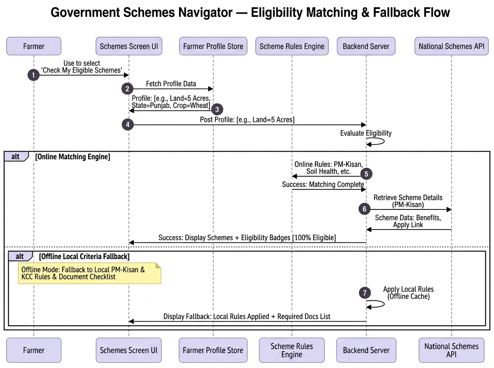
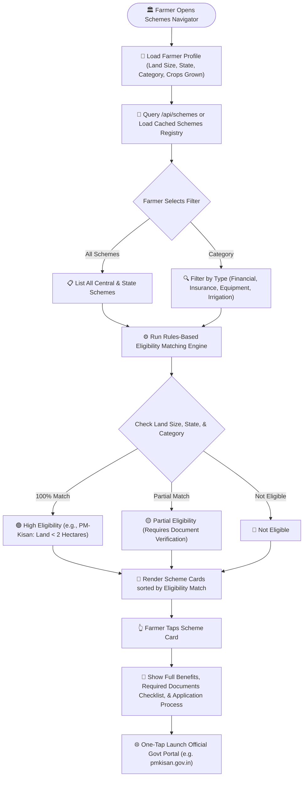
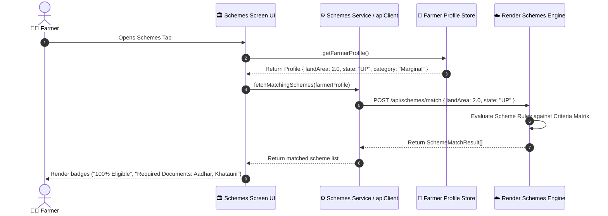
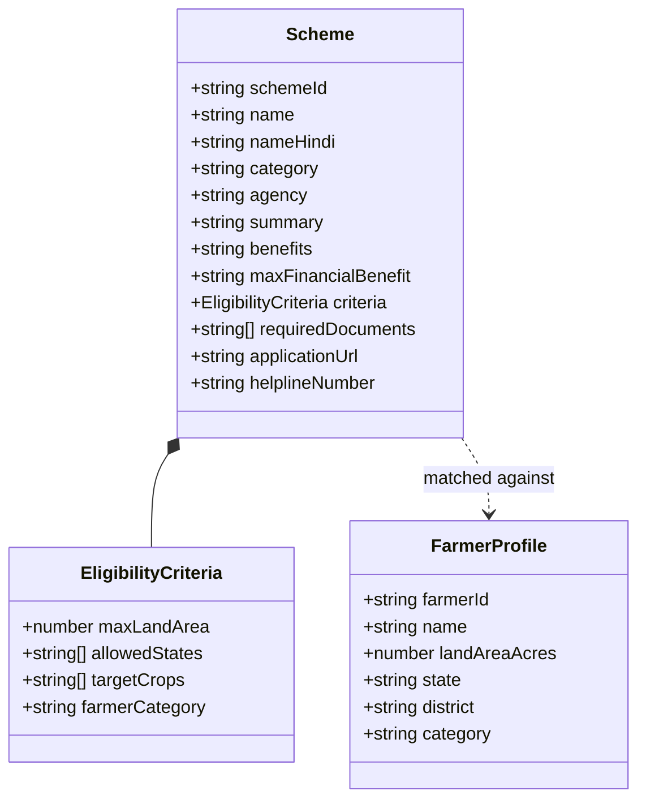

# Government Schemes Navigator

## Overview

The **Government Schemes Navigator** helps smallholder and marginal farmers discover, check eligibility for, and apply to national and state-specific agricultural welfare schemes (PM-Kisan Samman Nidhi, Kisan Credit Card, PM Fasal Bima Yojana, Soil Health Card Scheme, Sub-Mission on Agricultural Mechanization).

## Visual UML Sequence & Fallback Diagram

---

## 1. Scheme Matching Engine & Application Flowchart

---

## 2. Scheme Eligibility Verification Sequence Diagram

---

## 3. Scheme & Eligibility Data Model Diagram

---

## Key Scheme Navigator Features

- **Document Checklist**: Provides exact lists of documents required (Aadhaar Card, Land Record/Khatauni, Bank Passbook, Passport Photo) so farmers prepare in advance.
- **Helpline Integration**: One-tap phone dialer connection to official scheme helpline numbers (e.g., PM-Kisan toll-free `155261`).
- **Direct Portal Deep Link**: Opens verified government web portals directly inside a secure browser session.
