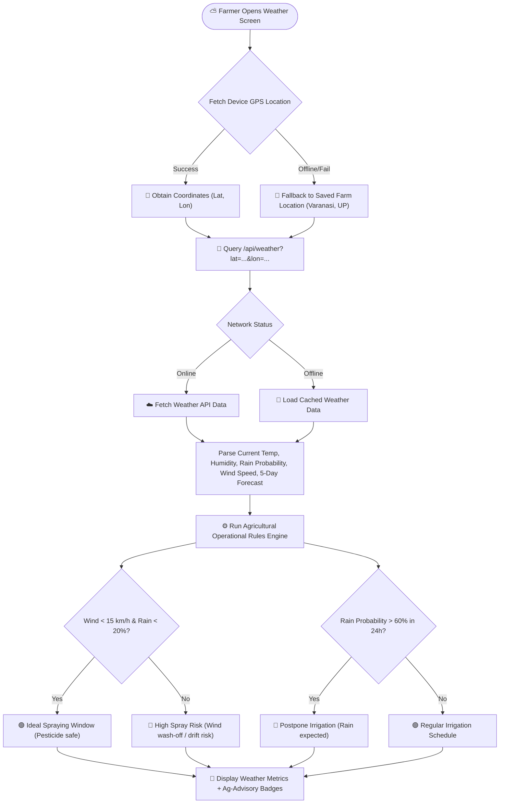
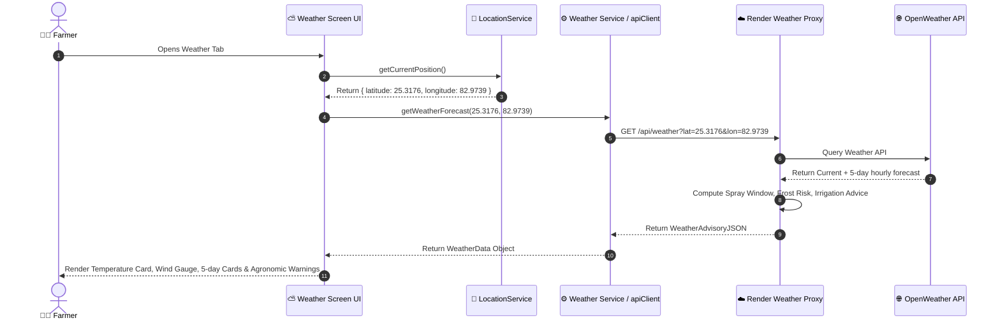
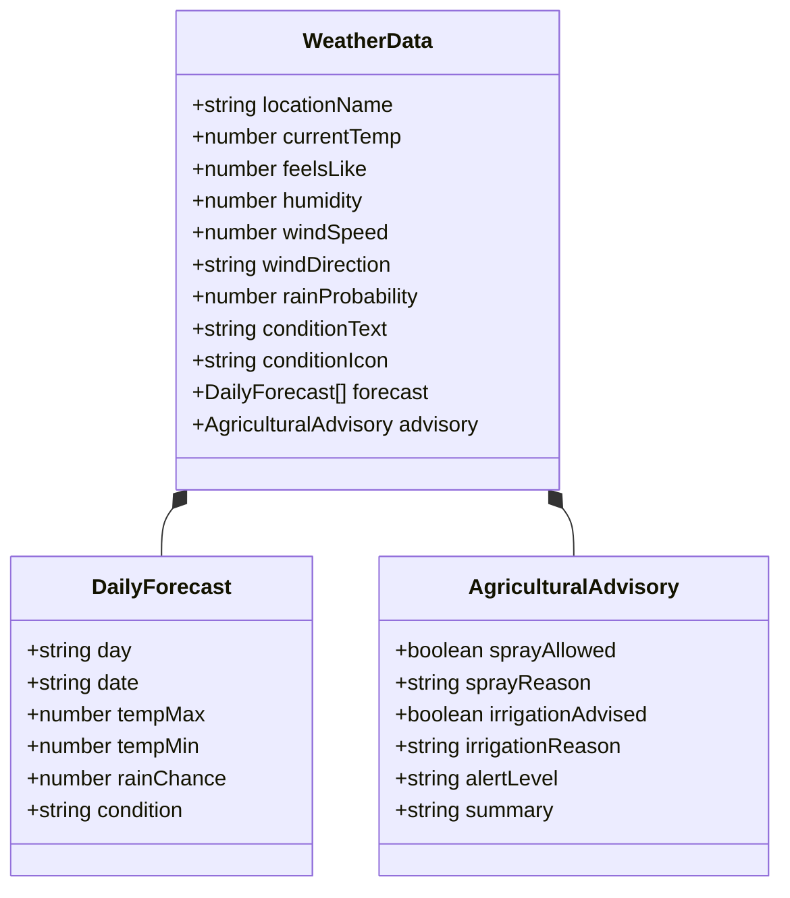

# Weather & Microclimate Advisory

## Overview

The **Weather & Microclimate Advisory** feature delivers hyper-local weather conditions (temperature, humidity, precipitation chance, wind speed, UV index) combined with **Agricultural Operational Alerts** (e.g. ideal pesticide spraying windows, frost alerts, heat stress warnings, irrigation postponement).

## Visual UML Sequence & Fallback Diagram

---

## 1. Weather Retrieval & Microclimate Alert Flowchart

---

## 2. Weather & Operational Advisory Sequence Diagram

---

## 3. Weather & Advisory Data Model Diagram

---

## Key Weather Feature Rules

1. **Pesticide Spray Safety Index**: Advises against spraying if wind speed exceeds 15 km/h (causing drift) or rain probability exceeds 30% (causing chemical wash-off).
2. **Irrigation Saver**: Warns farmers to hold off on canal or tubewell irrigation when heavy rainfall is forecasted within 24–48 hours, saving water and electricity costs.
