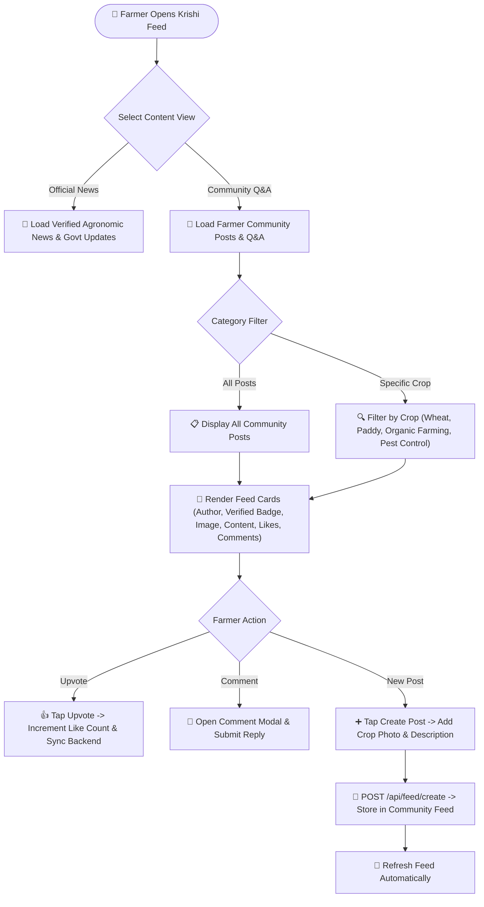
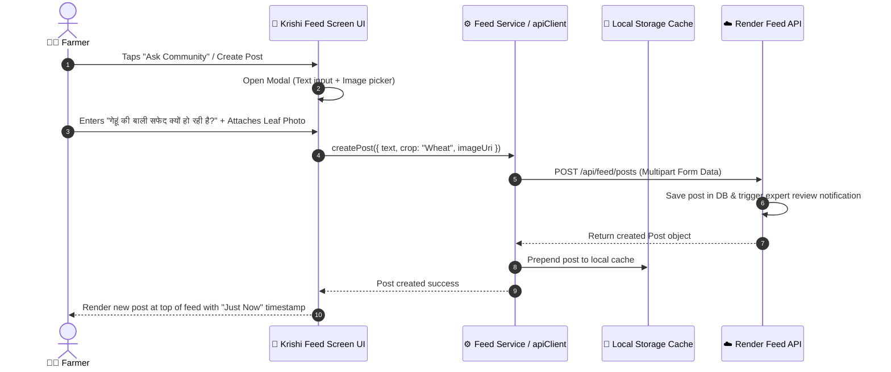
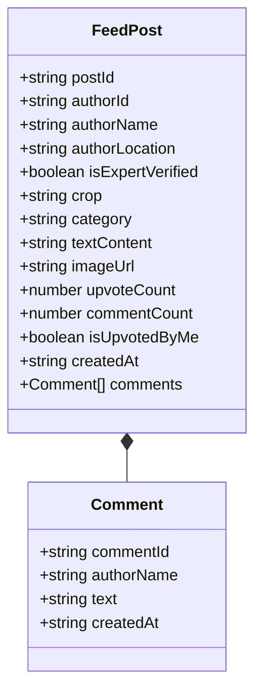

# Krishi Feed & Community Forum

## Overview

The **Krishi Feed & Community Forum** allows farmers to read verified agricultural news, government circulars, crop management tips, and participate in peer-to-peer farmer discussions (asking questions, sharing crop success photos, upvoting helpful advice).

## Visual UML Sequence & Fallback Diagram

---

## 1. Krishi Feed & Post Interaction Flowchart

---

## 2. Community Post Creation & Interaction Sequence Diagram

---

## 3. Feed Data Model Diagram

---

## Key Community Features

- **Expert Verification Badge**: Posts or answers authored by verified Krishi Vigyan Kendra (KVK) scientists or agricultural extension officers display a blue checkmark badge (`Verified Expert`).
- **Offline Post Reading**: Previously loaded feed items and news articles are cached locally for offline reading when farmers are in fields without network coverage.
