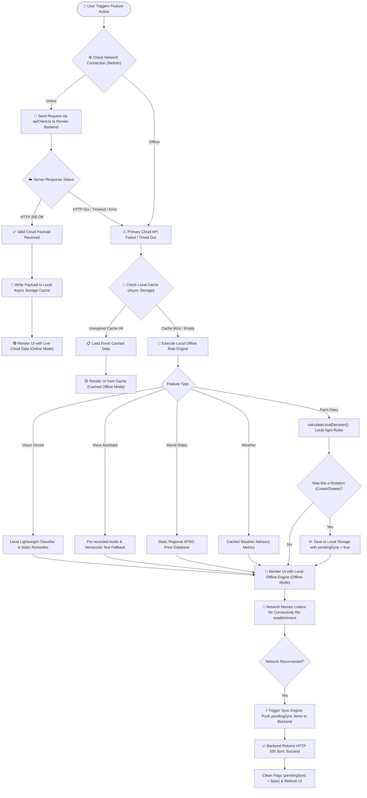
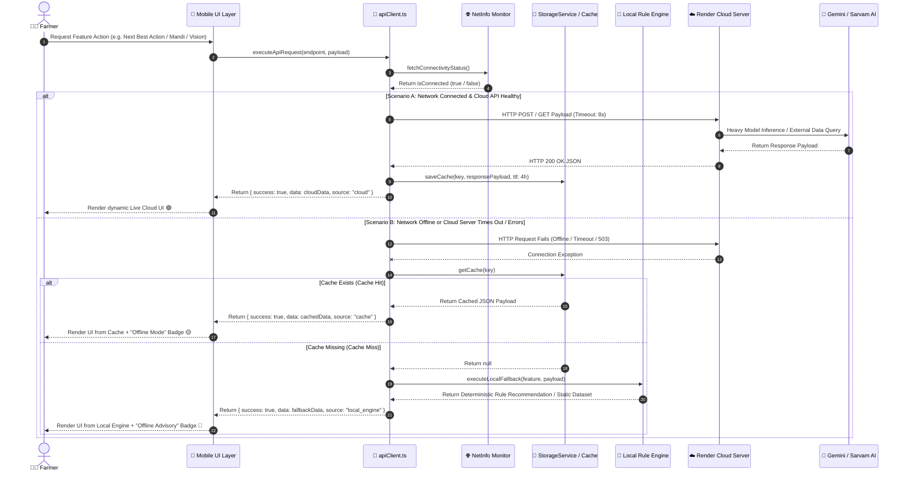
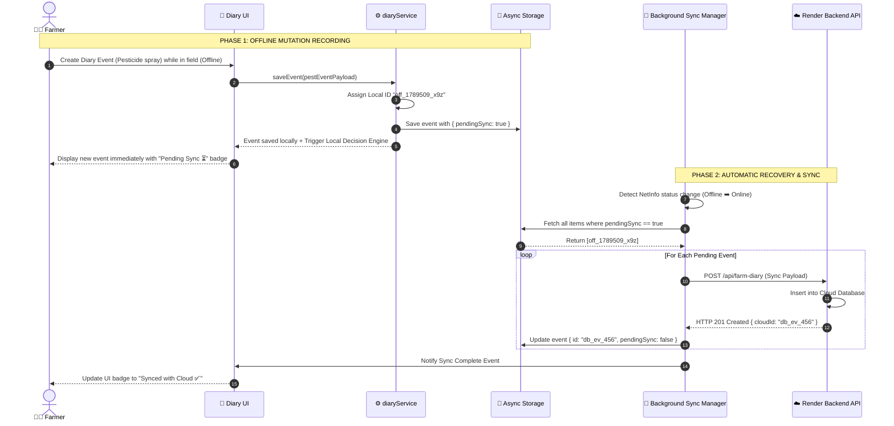

# Resilient Offline Fallback & Data Sync Architecture

## Overview

KrishiMitra AI is engineered for extreme reliability in rural connectivity environments. Because farmers frequently work in fields with zero or intermittent cellular connectivity (2G/3G drops), the application implements a **Three-Tier Fallback Hierarchy**:

1. **Tier 1 — Live Cloud AI Engine** (Primary: Render Backend + Gemini AI + Sarvam AI)
2. **Tier 2 — Cached Local Storage** (Fallback 1: Async Storage TTL Cache)
3. **Tier 3 — Local Offline Rule & Decision Engine** (Fallback 2: Zero-network offline logic)

## Visual Architecture & Fallback Diagram

---

## 1. Master Online/Offline Fallback & Execution Flowchart

---

## 2. API Request Lifecycle & Multi-Tier Fallback Sequence Diagram

---

## 3. Offline Queue & Background Auto-Synchronization Sequence

---

## Fallback System Comparison Matrix

| Feature | Primary (Online Cloud API) | Fallback 1 (Cached Local Storage) | Fallback 2 (Local Offline Engine) |
| :--- | :--- | :--- | :--- |
| **Farm Diary & Decision Engine** | Gemini AI Contextual Next Best Action | Last computed decision & historical events | `calculateLocalDecision()` deterministic rule engine |
| **Vision Crop Doctor** | Cloud TensorFlow / Keras + Gemini Remedies | Saved past scan diagnoses | Local lightweight classifier & organic remedies |
| **Voice AI Line** | Sarvam STT/TTS + Gemini LLM Speech | Local transcript history | Local pre-recorded audio assets & vernacular text |
| **Mandi APMC Rates** | Daily Agmarknet Govt Live Feed | Cached APMC prices (4-hour TTL) | Static regional APMC price database |
| **Govt Schemes** | Real-time Central/State Govt Rules | Saved eligible schemes registry | Local eligibility matrix (Land size & State rules) |
| **Weather Advisory** | Hyper-local OpenWeather API | Cached 5-day weather forecast | Microclimate operational rule calculation |
| **Krishi Feed** | Live Community Q&A & News Feed | Offline cached feed articles | Local extension advisory circulars |
