# KrishiMitra AI — All Features: Sequence Diagrams with Fallback & Connections

This document provides UML Sequence Diagrams for **all KrishiMitra AI features**, modeled to clearly illustrate:
1. How components (Farmer, Mobile App, Local Cache, Local Rule Engine, Backend Server, and Cloud AI) connect.
2. How the **multi-tier fallback** operates when network is offline or cloud APIs time out.
3. How **background auto-synchronization** recovers once connectivity is restored.

---

## 1. Master System Architecture: End-to-End Fallback & Sync Sequence

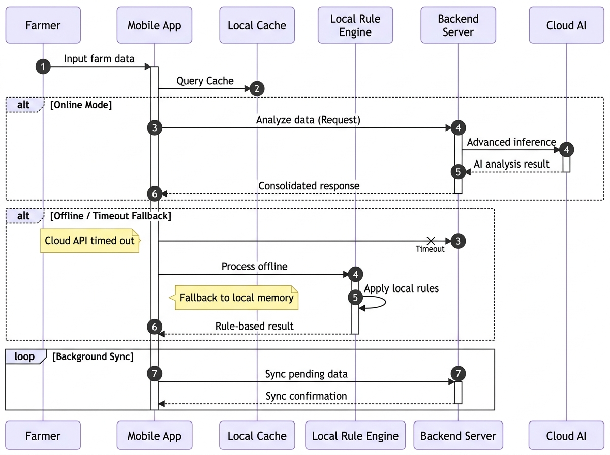

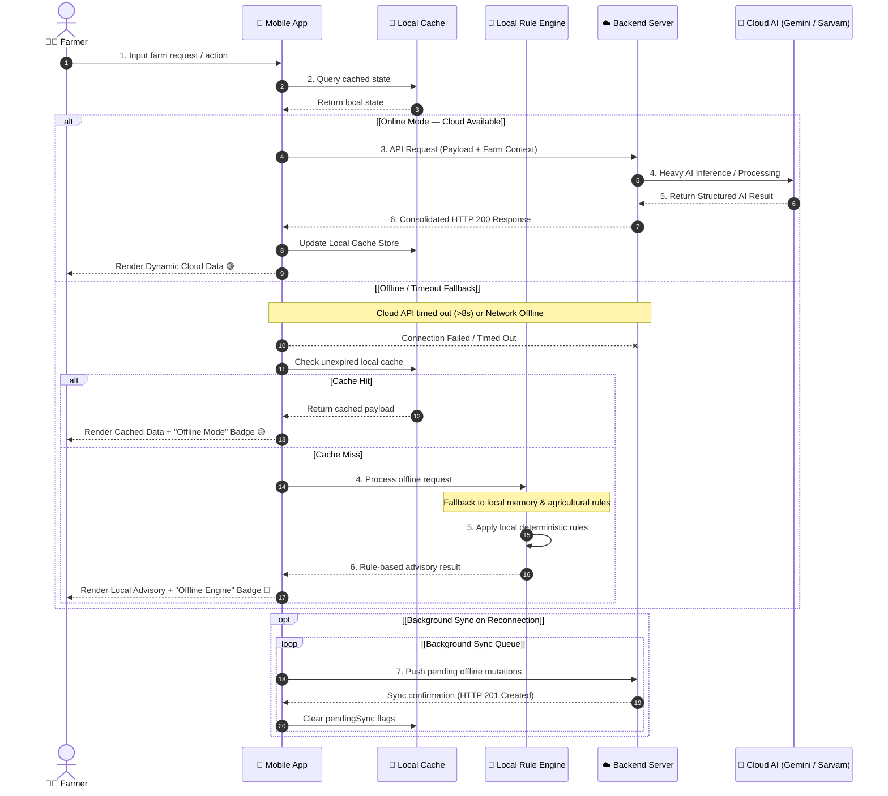

---

## 2. Feature 1: Farm Diary & Agentic AI Decision Engine

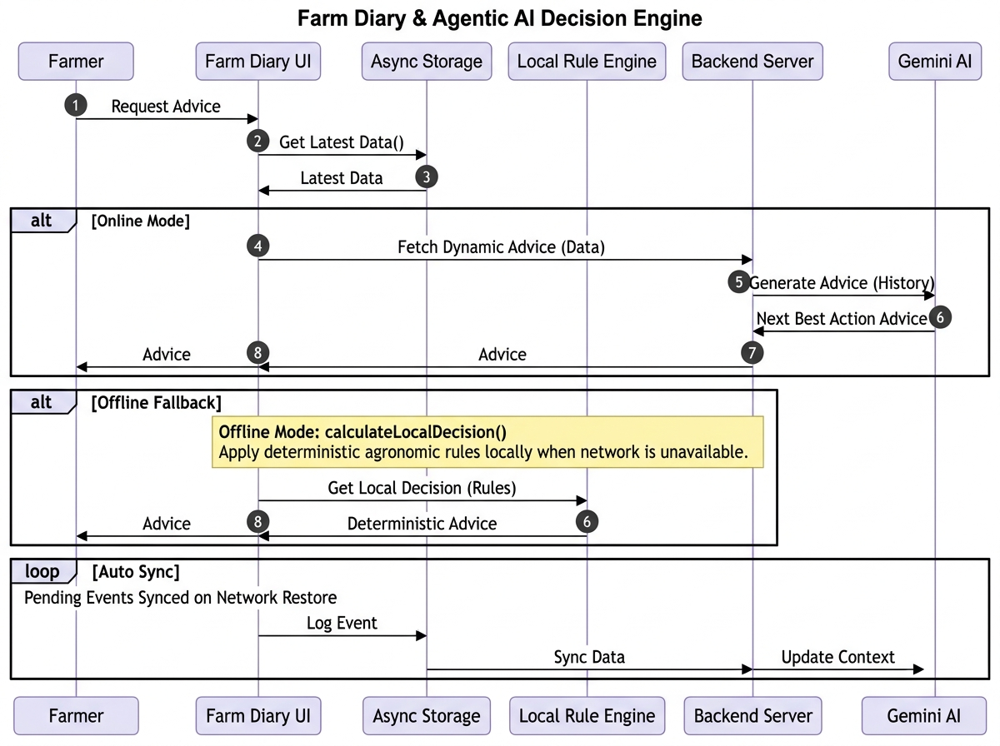

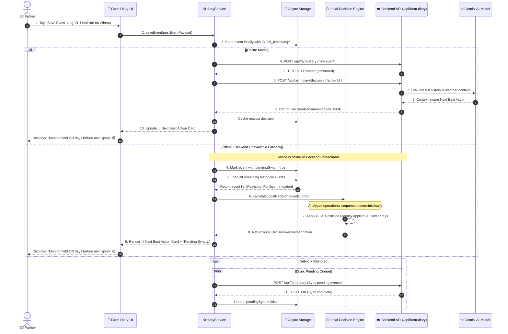

---

## 3. Feature 2: Vision Lab (Crop Disease Scan & Treatment Advisory)

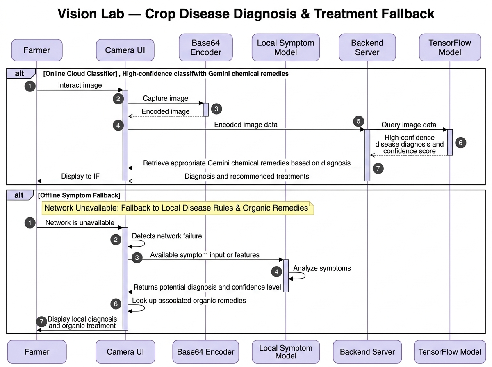

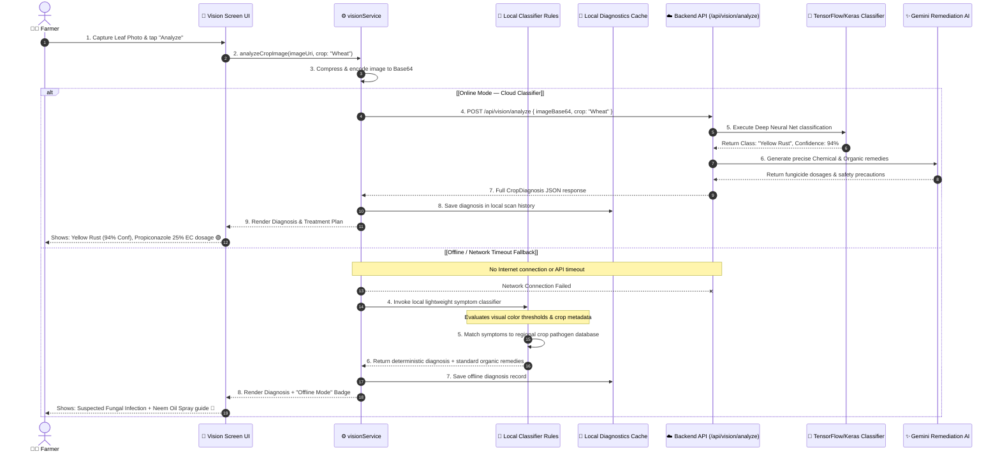

---

## 4. Feature 3: Voice AI Assistant (Multilingual Vernacular Line)

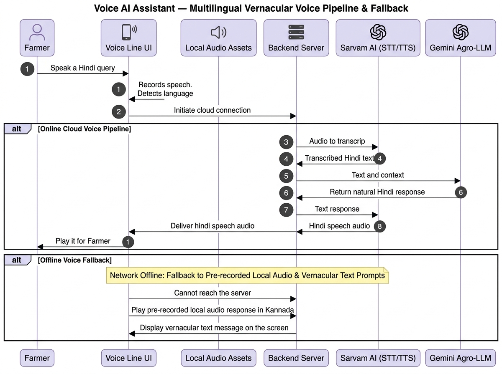

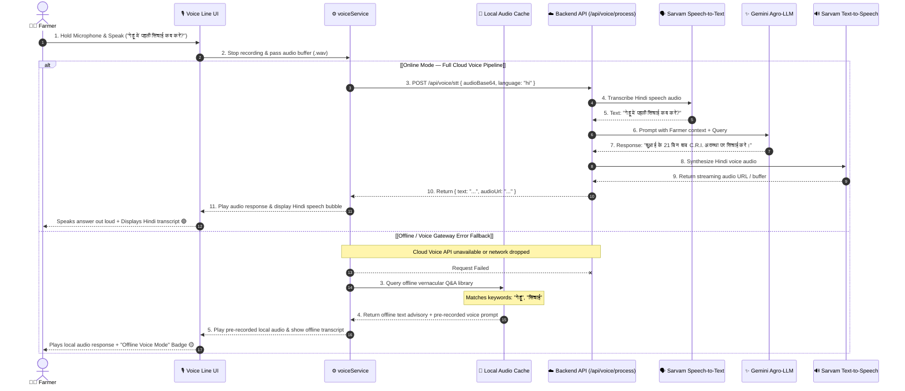

---

## 5. Feature 4: Mandi Prices & APMC Market Intelligence

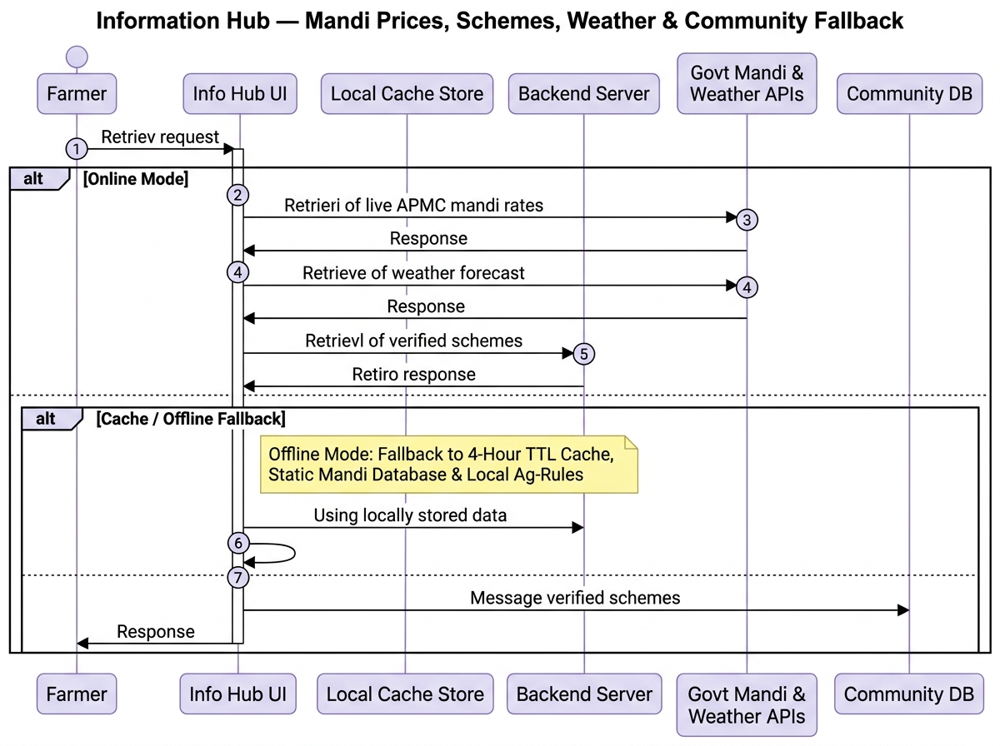

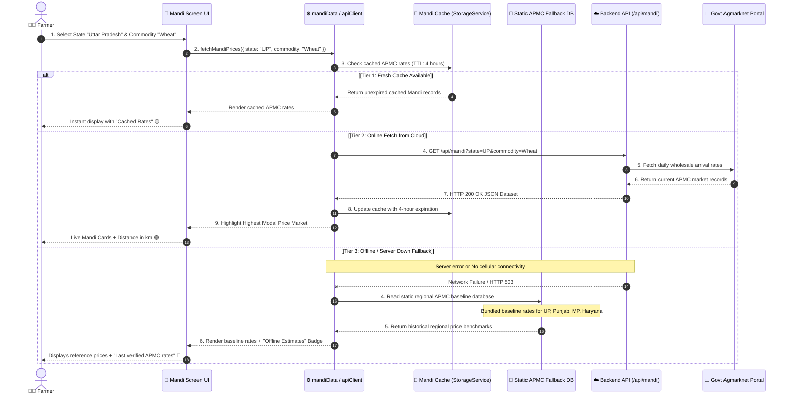

---

## 6. Feature 5: Government Schemes Navigator

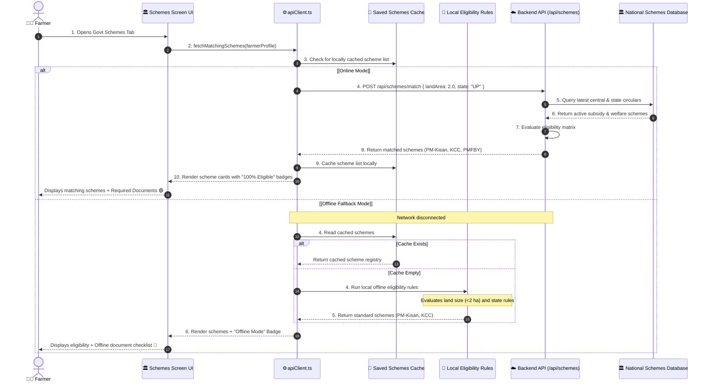

---

## 7. Feature 6: Weather & Microclimate Advisory

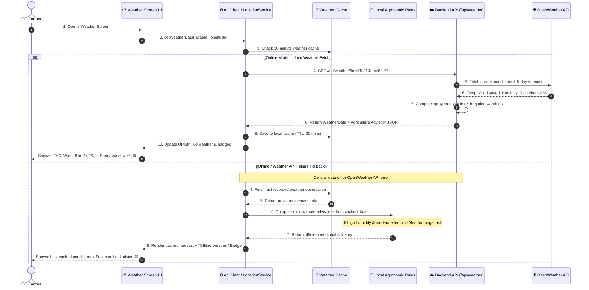

---

## 8. Feature 7: Krishi Feed & Community Forum

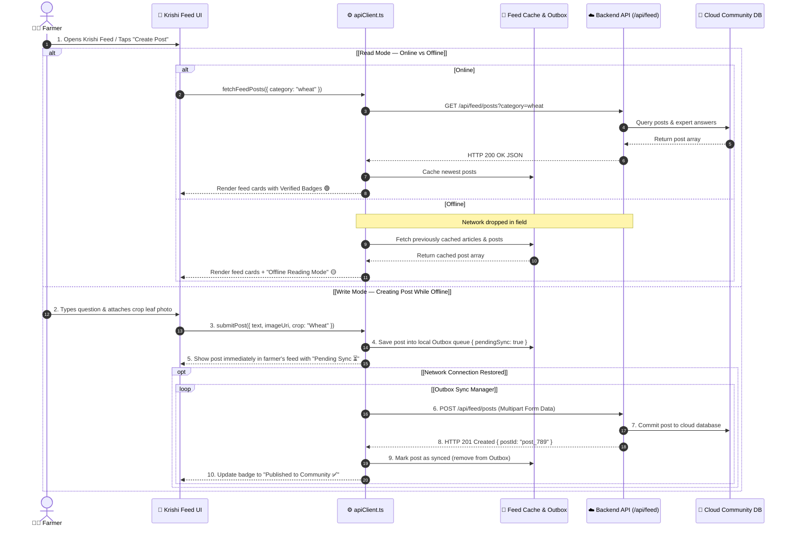

---

## 9. Fallback & Connection Matrix Across All Features

| Feature | Primary Online Component | Network Timeout Threshold | Fallback 1 (Cache Tier) | Fallback 2 (Local Engine Tier) | Sync Queue Trigger |
| :--- | :--- | :--- | :--- | :--- | :--- |
| **Farm Diary** | `/api/farm-diary/decision` + Gemini AI | 6 seconds | Last computed decision in AsyncStorage | `calculateLocalDecision()` rule engine | `NetInfo` reconnect event |
| **Vision Lab** | `/api/vision/analyze` + TF Server | 10 seconds | Scan history in AsyncStorage | Local visual heuristic rule classifier | Auto-sync on connection |
| **Voice Line** | `/api/voice/process` + Sarvam STT/TTS | 8 seconds | Cached Q&A transcripts | Pre-recorded regional audio assets | N/A (Session-based) |
| **Mandi Rates** | `/api/mandi` + Agmarknet Portal | 6 seconds | 4-Hour TTL local storage cache | Static regional APMC baseline database | 4-Hour TTL expiration |
| **Govt Schemes** | `/api/schemes/match` | 6 seconds | Saved scheme registry | Local Land Size & State eligibility rules | Background periodic check |
| **Weather** | `/api/weather` + OpenWeather | 5 seconds | 30-Minute TTL forecast cache | Local agronomic seasonal rule engine | 30-Minute TTL expiration |
| **Krishi Feed** | `/api/feed/posts` | 6 seconds | Cached news & community posts | Offline circular reading list | Outbox sync on reconnect |
