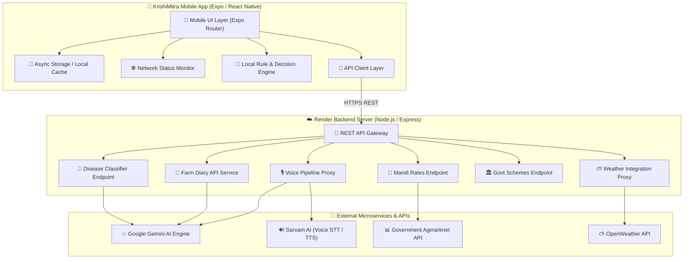
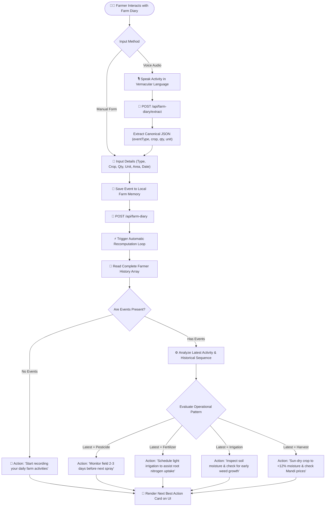
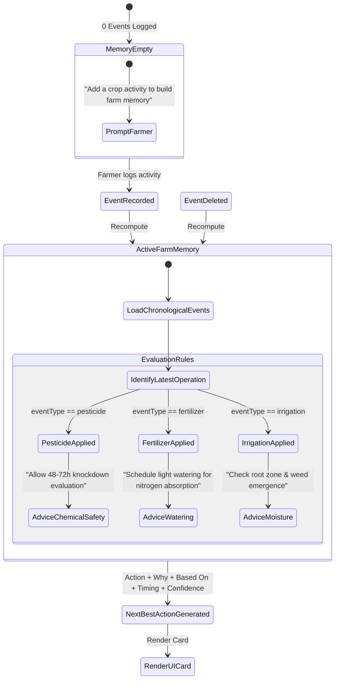
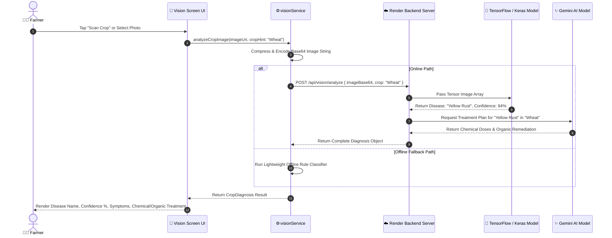
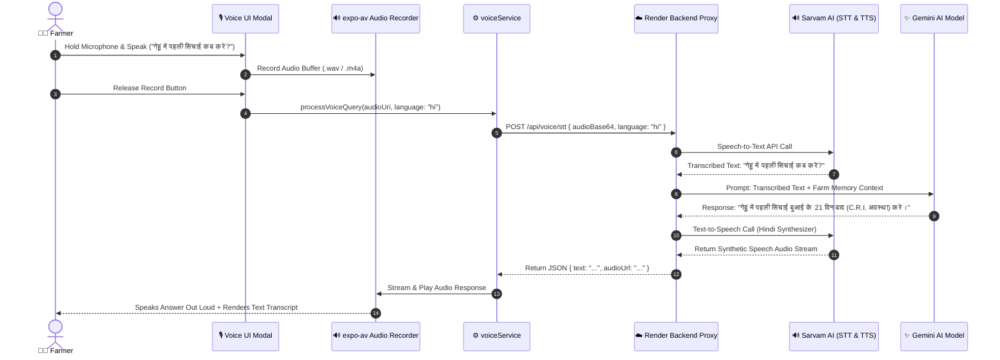
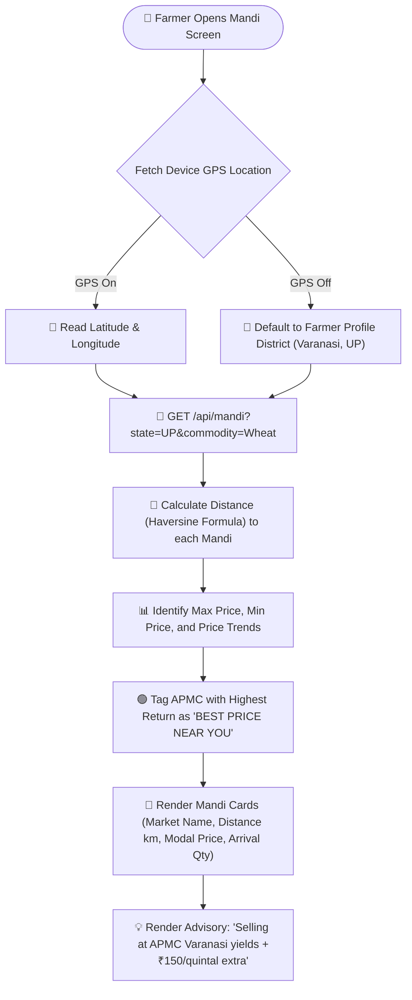
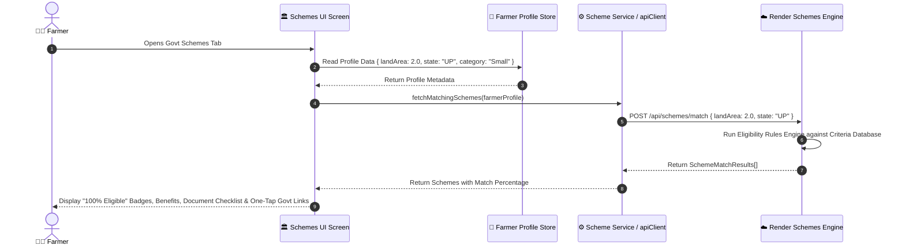
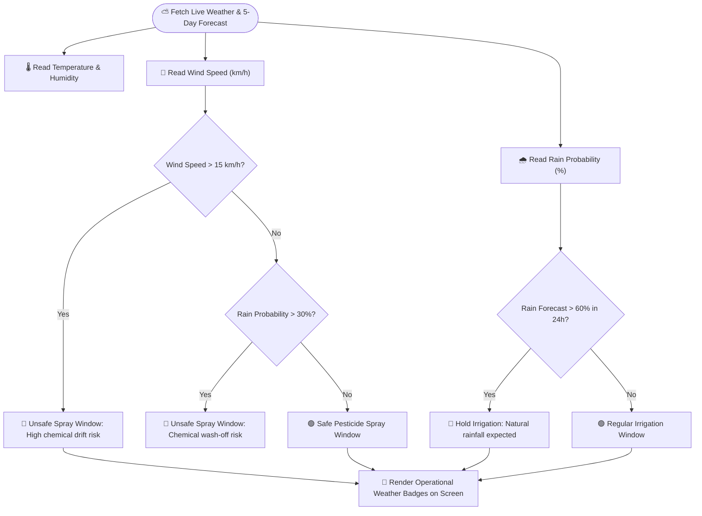
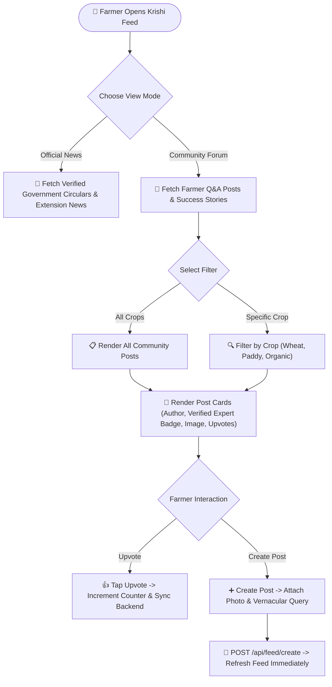
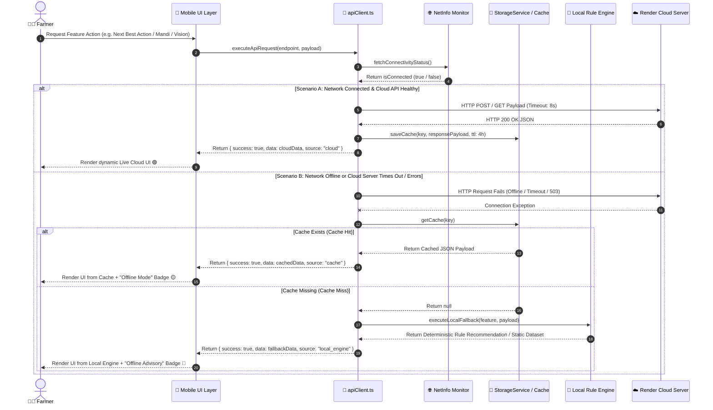

# KrishiMitra AI — All Features: Complete Technical Narrative & Mermaid Diagrams

This document contains the complete technical text explanation, workflow breakdown, and **Mermaid diagrams** for every feature in the **KrishiMitra AI** platform.

---

## Table of Contents

1. [Feature 1: Core System Architecture & Topology](#feature-1-core-system-architecture--topology)
2. [Feature 2: Farm Diary & Agentic AI Decision Engine](#feature-2-farm-diary--agentic-ai-decision-engine)
3. [Feature 3: Vision Lab (Crop Disease Scan & Treatment Advisory)](#feature-3-vision-lab-crop-disease-scan--treatment-advisory)
4. [Feature 4: Voice AI Assistant (Multilingual Vernacular Voice Line)](#feature-4-voice-ai-assistant-multilingual-vernacular-voice-line)
5. [Feature 5: Mandi Prices & APMC Market Intelligence](#feature-5-mandi-prices--apmc-market-intelligence)
6. [Feature 6: Government Schemes Navigator](#feature-6-government-schemes-navigator)
7. [Feature 7: Weather & Microclimate Advisory](#feature-7-weather--microclimate-advisory)
8. [Feature 8: Krishi Feed & Community Forum](#feature-8-krishi-feed--community-forum)
9. [Feature 9: Resilient Multi-Tier Fallback & Data Sync Architecture](#feature-9-resilient-multi-tier-fallback--data-sync-architecture)

---

## Feature 1: Core System Architecture & Topology

### Comprehensive Explanation
KrishiMitra AI is designed with a **resilient hybrid mobile architecture**. It prioritizes local execution and offline caching on the farmer's mobile device via React Native / Expo, backed by an Express/Node.js microservice architecture on Render. Heavy AI tasks (such as multilingual voice processing, multimodal image analysis, and deep agricultural context reasoning) are delegated to cloud AI services (Google Gemini API and Sarvam AI).

### System Topology Flowchart

---

## Feature 2: Farm Diary & Agentic AI Decision Engine

### Comprehensive Explanation
The **Farm Diary** serves as the farmer's digital **Farm Memory**. When a farmer performs field operations (applying pesticide, sowing wheat, irrigating, applying urea fertilizer, harvesting), the activity is recorded with canonical metadata (`eventType`, `crop`, `quantity`, `unit`, `area`, `date`). 

The **Agentic AI Decision Engine** continually monitors this event sequence. It evaluates past operations alongside crop growth stages and microclimate conditions to compute a dynamic **🌱 NEXT BEST ACTION** card. If an event is deleted or a new activity is saved, the engine automatically recomputes the recommendation in real-time.

### Event Processing & Recomputation Flowchart

### Agentic State Machine

---

## Feature 3: Vision Lab (Crop Disease Scan & Treatment Advisory)

### Comprehensive Explanation
The **Vision Lab (Crop Doctor)** enables instant field diagnostics for plant diseases. A farmer snaps a photo of an infected leaf or stem. The image is compressed and passed to a trained deep neural network model. The system identifies the specific disease, calculates a diagnostic confidence percentage, assesses severity, and provides actionable **Chemical** (e.g. fungicide spray doses per acre) and **Organic** (e.g. neem oil, biological control) remediation steps.

### Disease Diagnosis Sequence Diagram

---

## Feature 4: Voice AI Assistant (Multilingual Vernacular Voice Line)

### Comprehensive Explanation
The **Voice AI Assistant** bridges the literacy barrier for rural farmers. By tapping the voice microphone icon, farmers can ask agricultural questions in their spoken native language (Hindi, Punjabi, Marathi, Gujarati, Telugu, Tamil, English). 

The audio stream is transcribed via Sarvam AI's speech-to-text engine, enriched with the farmer's local crop context, answered by Google Gemini, and spoken back out loud using Sarvam AI's text-to-speech synthesizer.

### Multilingual Voice Pipeline Diagram

---

## Feature 5: Mandi Prices & APMC Market Intelligence

### Comprehensive Explanation
The **Mandi Prices** module fetches live daily APMC wholesale rates across Indian markets. It integrates device GPS coordinates to calculate the physical distance (in kilometers) from the farmer's location to nearby market yards. The engine computes modal prices, price spreads (Min vs. Max), and highlights the market providing the highest financial return.

### Mandi Distance & Rate Recommendation Flowchart

---

## Feature 6: Government Schemes Navigator

### Comprehensive Explanation
The **Government Schemes Navigator** demystifies public welfare programs (PM-Kisan Samman Nidhi, Kisan Credit Card, PM Fasal Bima Yojana, Soil Health Card). It evaluates the farmer's profile (land holding size in acres, state, crop type, category) against eligibility criteria matrices to highlight qualifying schemes and document requirements.

### Scheme Eligibility Sequence Diagram

---

## Feature 7: Weather & Microclimate Advisory

### Comprehensive Explanation
The **Weather & Microclimate Advisory** feature combines temperature, humidity, precipitation probability, and wind speed forecasts with **agronomic operational rules**. It provides clear recommendations on whether weather conditions are safe for pesticide spraying or if scheduled irrigation should be postponed.

### Weather Operational Advisory Decision Tree

---

## Feature 8: Krishi Feed & Community Forum

### Comprehensive Explanation
The **Krishi Feed & Community Forum** delivers verified agricultural news, crop management circulars, and a peer-to-peer discussion forum. Farmers can post questions, attach photos of crop symptoms, and receive answers from verified agricultural extension scientists or fellow farmers.

### Community Post & Interaction Flowchart

---

## Feature 9: Resilient Multi-Tier Fallback & Data Sync Architecture

### Comprehensive Explanation
KrishiMitra AI is engineered for zero data loss in disconnected environments. When network connection drops or a backend cloud API times out, the application automatically triggers a **Multi-Tier Fallback**:
- **Tier 1 (Cloud AI)**: Primary live cloud REST API call.
- **Tier 2 (Async Cache)**: Unexpired local JSON cache payload.
- **Tier 3 (Local Rules Engine)**: Zero-network deterministic decision engine.

Any user mutations (adding or deleting diary entries) performed while offline are saved with `pendingSync: true`. When connectivity is restored, the background sync manager automatically pushes pending payloads to the cloud database.

### Multi-Tier Fallback Sequence Diagram

---

## Technical Maintenance & Summary Matrix

| Feature Module | Primary Component | Key Data Contract | External Services | Fallback Strategy |
| :--- | :--- | :--- | :--- | :--- |
| **System Core** | `_layout.tsx` / `apiClient.ts` | `ApiConfig`, `NetworkState` | Render Backend Proxy | Auto-Retry + Offline Queue |
| **Farm Diary** | `diary.tsx` / `diaryService.ts` | `FarmDiaryEvent`, `DecisionRecommendation` | Gemini AI, Local Storage | `calculateLocalDecision()` Rules |
| **Vision Lab** | `vision.tsx` / `visionService.ts` | `CropDiagnosis`, `TreatmentOptions` | TensorFlow / Keras, Gemini AI | Local Rule Classifier |
| **Voice Line** | `assistant.tsx` / `voiceService.ts` | `VoiceSession`, `AudioStream` | Sarvam AI (STT/TTS), Gemini AI | Local Vernacular Text & Audio |
| **Mandi Prices** | `info/mandi.tsx` / `mandiData.ts` | `MandiItem`, `MandiSummary` | Agmarknet API, GPS Location | Cached APMC Rates (4h TTL) |
| **Govt Schemes** | `info/schemes.tsx` | `Scheme`, `EligibilityCriteria` | Govt Portals, Rules Engine | Local Criteria Matrix |
| **Weather** | `info/weather.tsx` / `locationService.ts` | `WeatherData`, `AgriculturalAdvisory` | OpenWeather API, GPS Location | Microclimate Rule Calculator |
| **Krishi Feed** | `info/news.tsx` | `FeedPost`, `Comment` | Community DB, KVK Extension | Cached News Circulars |

