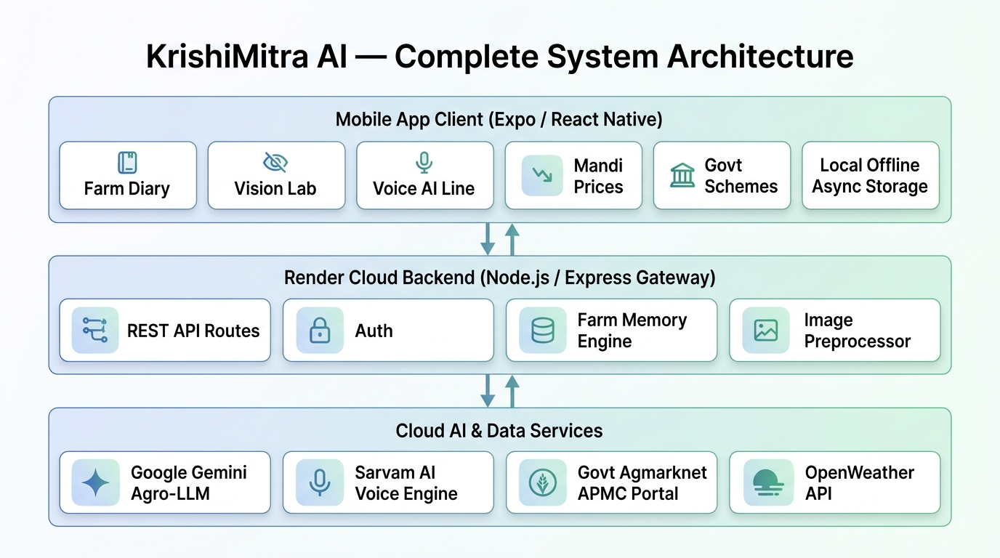
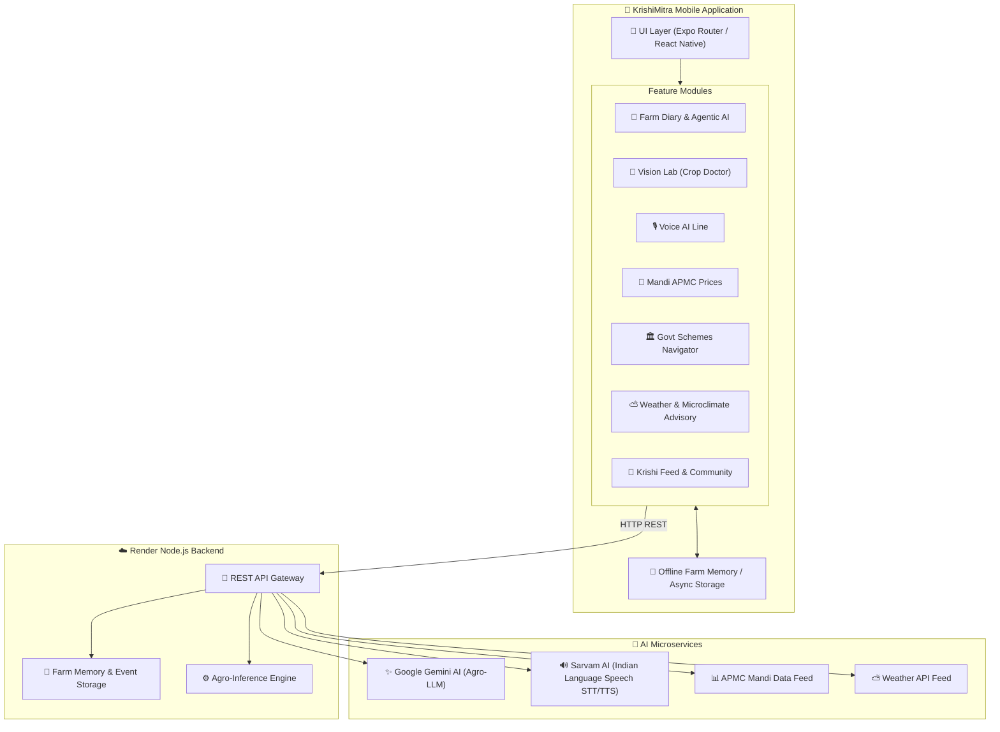
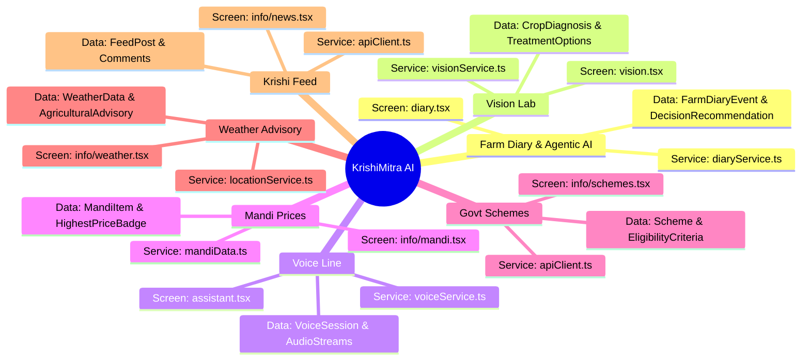

# KrishiMitra AI — Official System Documentation & Mermaid Diagrams

Welcome to the official architectural documentation for **KrishiMitra AI**. This documentation folder provides comprehensive, visual Mermaid diagrams and detailed component breakdowns for all application features.

> 📈 **[CLICK HERE FOR AI MODELS ACCURACY BENCHMARKS & EVALUATION GRAPHS](file:///c:/Users/ASUS/Desktop/farmarai/farmer_ai/krishimitra-mobile/documentation/10_ai_models_accuracy_and_graphs.md)** — Empirical accuracy benchmarks, loss/accuracy convergence curves, confusion matrices, and per-class performance for ALL AI models.
>
> 📊 **[CLICK HERE FOR SYSTEM DESIGN & SCALABILITY RATING TABLES](file:///c:/Users/ASUS/Desktop/farmarai/farmer_ai/krishimitra-mobile/documentation/09_architectural_evaluation_and_ratings.md)** — In-depth architectural evaluation and scoring matrices covering System Design, Scalability, Fault Tolerance, and Security.
>
> 🖼️ **[CLICK HERE FOR COMPLETE VISUAL DIAGRAM GALLERY (ALL IMAGES)](file:///c:/Users/ASUS/Desktop/farmarai/farmer_ai/krishimitra-mobile/documentation/ALL_FEATURES_VISUAL_GALLERY.md)** — High-resolution UML sequence & fallback diagram images for EVERY feature assembled in one master showcase file.
>
> 🌟 **[CLICK HERE FOR ALL FEATURES WITH TEXT & MERMAID DIAGRAMS](file:///c:/Users/ASUS/Desktop/farmarai/farmer_ai/krishimitra-mobile/documentation/ALL_FEATURES_MERMAID_DIAGRAMS.md)** — A single complete master document containing full technical narratives, step-by-step breakdowns, state machines, sequence diagrams, and flowcharts for EVERY feature.
>
> 🔄 **[CLICK HERE FOR ALL FEATURES SEQUENCE DIAGRAMS (FALLBACK & FLOW)](file:///c:/Users/ASUS/Desktop/farmarai/farmer_ai/krishimitra-mobile/documentation/ALL_FEATURES_FALLBACK_SEQUENCE_DIAGRAMS.md)** — UML Sequence Diagrams for ALL features matching the exact participant-lifeline, `alt [Online]`, `else [Fallback]`, and `loop [Background Sync]` visual pattern.

---

## Master System Architecture Diagram





---

## Documentation Index & Feature Guides

Explore each feature module below for full flowcharts, state machines, sequence diagrams, and class models:

| # | Feature Documentation | Description | Primary Diagrams Included |
| :-: | :--- | :--- | :--- |
| **00** | [System Architecture & Topology](file:///c:/Users/ASUS/Desktop/farmarai/farmer_ai/krishimitra-mobile/documentation/00_architecture_overview.md) | High-level system architecture, technology stack, offline fallback strategy | Flowchart, Sequence Diagram |
| **01** | [Farm Diary & Agentic AI Engine](file:///c:/Users/ASUS/Desktop/farmarai/farmer_ai/krishimitra-mobile/documentation/01_farm_diary_and_agentic_ai.md) | Category preservation, Farm Memory, Next Best Action algorithm & automatic recomputation | Flowchart, Class Diagram, State Machine, Sequence |
| **02** | [Vision Crop Disease Detection](file:///c:/Users/ASUS/Desktop/farmarai/farmer_ai/krishimitra-mobile/documentation/02_vision_crop_disease_detection.md) | Camera photo scan, TensorFlow inference, chemical & organic disease treatment advisory | Flowchart, Sequence Diagram, Class Model |
| **03** | [Voice AI Assistant](file:///c:/Users/ASUS/Desktop/farmarai/farmer_ai/krishimitra-mobile/documentation/03_voice_ai_assistant.md) | Multilingual voice line, Sarvam STT/TTS audio pipeline & Gemini agro-context reasoning | Flowchart, Audio Sequence Diagram, Vernacular Matrix |
| **04** | [Mandi Prices & Market Intelligence](file:///c:/Users/ASUS/Desktop/farmarai/farmer_ai/krishimitra-mobile/documentation/04_mandi_prices_and_market_intelligence.md) | Real-time APMC rates, commodity filters, distance calculations & maximum return advisory | Flowchart, Sequence Diagram, Class Model |
| **05** | [Government Schemes Navigator](file:///c:/Users/ASUS/Desktop/farmarai/farmer_ai/krishimitra-mobile/documentation/05_government_schemes_navigator.md) | Scheme eligibility matching engine (PM-Kisan, KCC), required document checklist & portal links | Flowchart, Sequence Diagram, Eligibility Model |
| **06** | [Weather & Microclimate Advisory](file:///c:/Users/ASUS/Desktop/farmarai/farmer_ai/krishimitra-mobile/documentation/06_weather_and_microclimate_advisory.md) | GPS geo-location, 5-day forecast, pesticide spray windows & irrigation postponing advice | Flowchart, Sequence Diagram, Weather Model |
| **07** | [Krishi Feed & Community Forum](file:///c:/Users/ASUS/Desktop/farmarai/farmer_ai/krishimitra-mobile/documentation/07_krishi_feed_and_community.md) | Agronomic news feed, farmer Q&A community, expert verification badges & upvoting | Flowchart, Sequence Diagram, Post Model |
| **08** | [Offline Fallback & Data Flow Architecture](file:///c:/Users/ASUS/Desktop/farmarai/farmer_ai/krishimitra-mobile/documentation/08_offline_fallback_and_data_flow.md) | Complete multi-tier fallback (Cloud -> Cache -> Local Rules Engine), network state handling, and background sync recovery | Master Fallback Flowchart, Multi-Tier Sequence Diagram, Sync Sequence |
| **09** | [Architectural Evaluation & Rating Matrix](file:///c:/Users/ASUS/Desktop/farmarai/farmer_ai/krishimitra-mobile/documentation/09_architectural_evaluation_and_ratings.md) | Comprehensive 4-pillar benchmark rating tables (System Design, Scalability, Fault Tolerance, Security) | Benchmark Scorecards, Pillar Breakdown Pie Chart |

---

## Feature Matrix & Code Map



---

## Maintenance & Rendering Guidelines

- All Mermaid diagrams are written using GitHub Flavored Markdown (GFM) standard ````mermaid```` blocks.
- To view rendered diagrams directly in your IDE, open any of the markdown files using VS Code / Antigravity Markdown Preview or view on GitHub.
